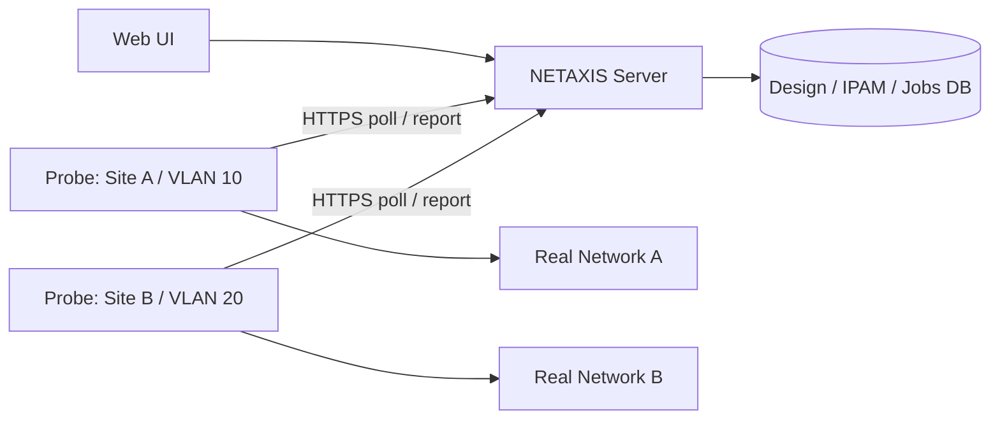

# NETAXIS — Network IP Planning, Design, Scaling & Live Verification

เปิดห้อง แล้วกด **IP Planning** ที่แถบด้านบน แผน IPAM บันทึกแยกจาก topology revision ใน SQLite เดียวกัน เจ้าของ/editor แก้ไขแผนและสั่งตรวจได้ viewer อ่านแผน/ผลตรวจได้ เจ้าของเป็นผู้ enroll/revoke Probe ไม่มีระบบ login ส่วนกลาง

## Plan → Calculate → Validate

1. กำหนด IPv4 parent CIDR เช่น `10.20.0.0/16`
2. เพิ่มแถว site / department / VLAN พร้อมจำนวน hosts, growth % และจำนวน reserved IP
3. กด **Calculate & Validate** ระบบจัด VLSM จาก block ใหญ่ไปเล็ก หัก network/broadcast, gateway 1 IP และ reserved IP ก่อนคำนวณ host capacity
4. ดู network/broadcast, usable range, gateway/reserved, capacity, wasted addresses และ utilization แต่ละ subnet
5. ช่อง Manual overrides ใช้กำหนด subnet/gateway/reserved IP เอง ส่วนที่เป็น Auto จะจัดให้ไม่ทับ subnet ที่ระบุเอง
6. IPAM ใช้บันทึก device/server/reserved/free พร้อม expected MAC หรือดึง IPv4/MAC จาก topology ที่อยู่ในแผน การนำเข้าข้าม IP ซ้ำ/อยู่นอก subnet จะแจ้งจำนวนที่เพิ่ม
7. กด Calculate อีกครั้งเพื่อ Validate และบันทึกแผน

Growth demand = `ceil(hosts × (1 + growth / 100))` · Capacity ที่ตาราง Design แสดงหัก gateway และ reserved แล้ว · Wasted = capacity − growth demand · Utilization = growth demand / capacity

Validation ครอบคลุม overlap, parent capacity, duplicate VLAN ใน site เดียว, duplicate IP/gateway/reserved, IP นอก subnet, network/broadcast ที่ถูกใช้, unknown segment และ capacity ไม่พอ สามารถเก็บ draft ที่มี issues ได้ แต่จะ enroll Probe หรือสั่งงานจริงไม่ได้จนแก้ไขแล้ว

รุ่นนี้วางแผน IPv4 LAN/VLAN ด้วย subnet /30 หรือใหญ่กว่า ยังไม่มี IPv6 allocation, VRF/overlapping address spaces หรือ DHCP integration

## Scale / What-if

เปลี่ยน hosts เช่น 50 → 150 แล้วกด **Compare designs** ตารางแสดง subnet ก่อน/หลัง, subnet เดิมที่ไม่พอ และ `keep / reallocate / no-capacity` Scenario จัด VLSM ใหม่ทั้งแผน จึงอาจย้าย subnet อื่นด้วย

กด **ใช้ scenario ใน draft** เพื่อรับผล และ Validate อีกครั้งก่อนบันทึก IPAM และ reserved IP เดิมจะคงไว้เพื่อให้เห็น IP ที่ต้องย้าย จึงไม่เปลี่ยน IP ของอุปกรณ์จริงโดยอัตโนมัติ Gateway ที่สร้างอัตโนมัติจะคำนวณใหม่ การ Compare ไม่แก้แผนที่บันทึกบน server

แผนใช้ optimistic revision ถ้าอีก tab บันทึกก่อน จะตอบ 409 ให้โหลดแผนใหม่แทนการเขียนทับ

## Live Network Verification

**Server ไม่รัน ping หรือ command ไปยัง client network เอง** Probe รันบนเครื่องในแต่ละ segment และเชื่อมออกไป server ผ่าน HTTPS โดยไม่ต้องเปิด inbound port ของ Probe

### ติดตั้ง Probe

1. บันทึกแผนที่ไม่มี validation issues และเลือก subnet แบบ RFC1918 (`10/8`, `172.16/12`, `192.168/16`)
2. Live Verify → กรอก Probe name / เลือก segment → **Enroll Probe** (owner เท่านั้น)
3. ดาวน์โหลด `.env.probe` ทันที token แสดง/ดาวน์โหลดได้เฉพาะครั้งนั้น Server เก็บ token hash token ใช้ได้จนเจ้าของ Revoke
4. ใช้ Node >=22.12 บน Windows หรือ Linux ใน segment นั้น วาง checkout โปรเจกต์และ `.env.probe` ไว้ด้วยกัน แล้วติดตั้ง dependency ด้วย `npm ci`
5. รัน `npm run probe` หรือ `node --env-file=.env.probe scripts/probe-agent.js` ใช้ service/process manager สำหรับการรันต่อเนื่อง

Windows ใช้ `ping`, `Get-NetNeighbor`, `tracert`, `netstat` ที่ติดมากับระบบ Linux ต้องมี `ping` (iputils), `ip`/`ss` (iproute2) และ `traceroute` ถ้า command ขาดหรือเรียกไม่ได้จะแสดง error/warning ใน job ไม่สร้างข้อมูลปลอม ใช้สิทธิ์ที่ OS อนุญาต; netstat บาง process detail อาจไม่แสดงด้วยสิทธิ์ธรรมดา

Config ตัวอย่างอยู่ใน `.env.probe.example` ห้ามเผยแพร่ไฟล์ token Server URL ต้อง HTTPS ยกเว้น `http://localhost` / `http://127.0.0.1` สำหรับพัฒนา และ config ต้องระบุ enrolled subnet ตรงกับ server

### งาน on-demand

- **Ping scan**: ตรวจสูงสุด 256 usable IP ต่อครั้ง เริ่มจาก first usable + offset ใช้ offset 256, 512… สำหรับชุดถัดไป UI แสดงจำนวน targets/usable IP เพื่อไม่สรุป subnet ใหญ่จากผลบางส่วน
- **Host probe**: ping IPv4 เดียวใน subnet
- **ARP / Neighbor**: อ่าน neighbor cache ของ Probe โดยไม่ ping ทุก IP กรองเฉพาะ targets ในชุด offset นั้น `Reachable` เป็น active evidence; stale/static entry ไม่ถือว่าเครื่อง online
- **Traceroute**: ตรวจหนึ่ง IP ใน subnet จำกัด 12 hops และ timeout เก็บ output จริงใน job
- **Local netstat**: อ่าน TCP/UDP connection ของเครื่อง Probe ไม่ใช่ connection ของอุปกรณ์ทุกเครื่องใน network

แต่ละ Probe รัน jobs ตามลำดับ ใช้ ping พร้อมกันสูงสุด 8 IP poll ทุก 5 วินาที ทุก job มี lease, retry จำกัดและเก็บประวัติสูงสุด 100 jobs ต่อ Probe เรียก OS ผ่าน `execFile` พร้อม argument array, timeout และขนาด output จำกัด ไม่มีช่องให้ส่ง shell command

งานผูกกับ plan revision ถ้าแผนเปลี่ยนระหว่างรอ งานจะไม่รัน ผล revision เดิมไม่ถูกใช้เปรียบเทียบแผนใหม่ ถ้า subnet เปลี่ยนต้อง Revoke แล้ว enroll Probe ใหม่

### ผล Planned vs Observed

- `UNEXPECTED_DEVICE`: IP free/unplanned มี ping response หรือ active neighbor
- `MISSING_UNREACHABLE`: planned device/server ที่ตรวจด้วย ping แล้วไม่มี response และไม่มี active neighbor ไม่ได้ยืนยันว่า down เพราะอุปกรณ์อาจบล็อก ICMP
- `RESERVED_CONFLICT`: reserved IP มี active device ที่ไม่มี expected MAC หรือ MAC ไม่ตรง
- `MAC_MISMATCH`: MAC ที่พบต่างจาก IPAM
- `DUPLICATE_OBSERVED_IP`: IP เดียวมีหลาย MAC จากหลักฐานสด
- `CAPACITY_RISK`: unique observed hosts ใช้ usable addresses ≥80%

ใช้เฉพาะผลที่ server รับไม่เกิน 5 นาที แสดงจำนวน stale results แยกไว้ IP ที่ยังไม่ตรวจไม่ถูกจัดเป็น free/missing Observed utilization เป็น **lower bound** จาก IP ที่ตรวจพบ ส่วน design utilization เป็นความต้องการตาม requirement MAC จาก ARP/neighbor ตรวจได้เฉพาะ L2 ที่ Probe มองเห็น; routed hosts อาจไม่พบ MAC และไม่ถูกตัดสินว่า mismatch

## การตรวจสอบ

`npm run check` รวม unit tests ของ VLSM/growth/capacity/validation/live comparison, API tests ของ role/revision/probe scope/job lease/revocation และ Vue tests ของ Plan/What-if/IPAM/Verify ฟีเจอร์เดิมตรวจร่วมด้วย ทดสอบ real collectors กับเครื่อง local เท่านั้น ไม่ได้ยืนยัน deployment หรือการเข้าถึง site/VLAN จริงของผู้ใช้

คำสั่งและ process API อ้างอิง: [Microsoft Get-NetNeighbor](https://learn.microsoft.com/en-us/powershell/module/nettcpip/get-netneighbor), [Microsoft tracert](https://learn.microsoft.com/en-us/windows-server/administration/windows-commands/tracert), [Node child_process](https://nodejs.org/api/child_process.html)
